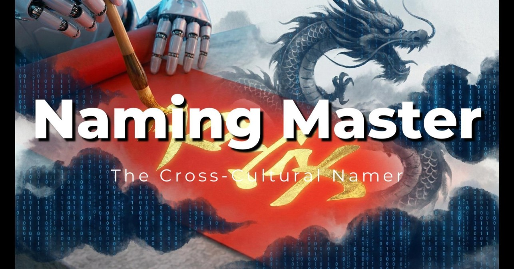
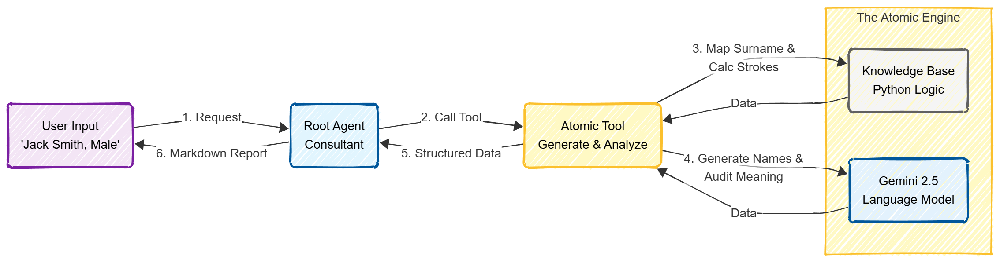

# 🐉 Project Overview - Naming Master


> **Capstone Project for the Google AI Agents Intensive**
> 
> *Track: Freestyle Agents | Built with Google ADK & Gemini 2.5 Flash-Lite*

This project contains the core logic for **Naming Master**, a hybrid multi-agent system designed to help non-native speakers find authentic, meaningful, and culturally safe Chinese names.

## Problem Statement

Finding a Chinese name is notoriously difficult for non-native speakers. With over **6.1 billion possible combinations**, a direct translation often results in names that sound awkward, have negative homophones (e.g., sounding like "death horse" or "pig"), are vulgar and boring, or lack cultural significance. 


To find a _good_ name, one must balance five conflicting dimensions:

- **🔊 Phonetics:** Does it sound like the original English name?
    
- **📖 Meaning:** Do the characters convey elegance, strength, or virtue?
    
- **🛡️ Cultural Safety:** Is it free of embarrassing homophones or slang?
    
- **🧮 Onomastics (Numerology):** Does the stroke count align with traditional "Sancai" luck algorithms?
    
- **🌏 Authenticity:** Does it sound like a real name from a Chinese-speaking region?
    

This complexity  of balancing **Phonetics** (sound), **Meaning** (semantics), and **Onomastics** (numerology/luck) creates a significant hurdle—not just for foreigners, but also for native speakers.


## Solution Statement

**Naming Master** acts as a "Lead Cultural Consultant" agent. Instead of relying on a single LLM prompt, it orchestrates a sophisticated pipeline that combines **Generative AI** (for linguistic nuance and creativity) with a deterministic **Knowledge Engine** (for accurate stroke counting and surname mapping). This hybrid approach ensures that every generated name is not only phonetically accurate but also mathematically "lucky" according to traditional Sancai numerology, thereby solving the "hallucination problem" common in pure LLM solutions.

## Value Statement

Naming Master transforms a process that usually requires a human consultant into an instant, reliable service. By automating the "Safety Audit" (homophone check) and "Luck Calculation" (stroke math), users save hours of research and are prevented from lifelong embarrassment by choosing a culturally inappropriate name.

---

## Architecture

Core to Naming Master is a **Stateless Root Agent** pattern that ensures reliability across multi-turn conversations. It does not just "chat"; it executes a rigorous **Atomic Workflow** for every request.




The system uses a **Stateless Root Agent** pattern to ensure reliability across multi-turn conversations. The **Atomic Tool** (`generate_and_analyze_names`) orchestrates a 4-step pipeline using specialized "Sub-Personas":

**1. The Name Librarian (Knowledge Base)**

* **Role:** Constraint & Mapping
    
* **Function:** Before any AI generation happens, the Librarian queries the internal database to map Western surnames (e.g., "Smith" → "Shi 史") or handles (e.g., "kamilky" → "Kang 康") to authentic Chinese surnames. This ensures the foundation of the name is culturally correct, not phonetic gibberish.
    

**2. The Name Creator (Gemini 2.5)**

* **Role:** Generative Creativity
    
* **Function:** Accepts the mandatory surname from the Librarian and uses `gemini-2.5-flash-lite` to creatively transliterate the _Given Name_. It optimizes for elegance, gender nuance, and concise 2-3 character structures.
    

**3. The Fortune Teller (Knowledge Base)**

* **Role:** Mathematical Audit
    
* **Function:** Once names are generated, the Fortune Teller takes over. It calculates the **Sancai Luck Score** using a hard-coded Kangxi stroke database. This solves the "LLM Hallucination" problem by ensuring the numerology is mathematically perfect (0-100 score).
    

**4. The Semantic Auditor (Gemini 2.5)**

* **Role:** Safety & Linguistic Audit
    
* **Function:** A final pass where the AI critiques its own work. It scans for negative homophones (e.g., "Si-Ma" sounding like "Dead Horse") and generates the character-by-character meaning breakdown for the final report.


---

## Key Features & Concepts

In this submission, I demonstrate the following advanced ADK concepts:

* ✅ **Custom Tools (Atomic Tooling):** I developed a unified tool that integrates Python logic (Math/Database) with Generative AI. This "Hybrid Tool" pattern solves the reliability issues of sequential agent chains.
* ✅ **Context Engineering:** The system prompt implements a "Stateless Processing" architecture, forcing the agent to clear its context window logic for every new request to prevent hallucinations from previous users.
* ✅ **Sessions & Memory:** The agent intelligently manages multi-turn slots (e.g., if a user provides a Name in Turn 1 and Gender in Turn 2, the agent retains state until the tool can be executed).

---

## Installation & Usage

This project was built against Python 3.10+.

**1. Install Dependencies**
```bash
pip install -r requirements.txt
```

**2. Set API Key**
```bash
export GOOGLE_API_KEY="your_api_key_here"
```

**3. Run the Agent (ADK Web UI). To launch the interactive chat interface:**
```bash
# Run from the root directory
adk web namer_agent
```

## 4. Running Tests (optional)
To verify the agent's logic programmatically, run the integration test:
```bash
python -m tests.test_agent
```

---

## 💡 Example Interaction

**User:** "My name is Mary Smith, Female."

**Agent Process:**
> 1.  **Surname Map:** Detected "Smith" → Mapped to Authentic Surname **'Shi' (史)**
> 2.  **Strategy Engine:**
>     * *Phonetic:* Transliterating "Mary" → **'Mei-Li' (梅莉)**
>     * *Semantic:* Extracting meaning "Mary" (Sea/Bitter) → **'Hai Yue' (海悅 - Ocean Joy)**
> 3.  **Safety Audit:** Scanning for negative homophones... **Passed (Safe)**
> 4.  **Numerology:** Calculating Sancai Stroke Luck... **95 (Auspicious)**
> 5.  **Synthesis:** Ranking top 5 candidates...

**Final Output:**

| Rank | Name | Meaning | Safety | Luck Score |
| :--- | :--- | :--- | :--- | :--- |
| 🥇 | **史梅莉** (Shǐ Méi Lì) | **史**: History, Chronicle (Surname)<br>**梅**: Plum Blossom, resilience<br>**莉**: Jasmine, elegance | ✅ Safe: No negative homophones found. | **95** (Auspicious) |
| 🥈 | **史瑪莉** (Shǐ Mǎ Lì) | **史**: History, Chronicle<br>**瑪**: Agate, precious stone<br>**莉**: Jasmine | ✅ Safe: Standard transliteration. | **95** (Auspicious) |
| 🥉 | **史海悅** (Shǐ Hǎi Yuè) | **史**: History<br>**海**: Ocean (Related to 'Mary')<br>**悅**: Joy, delight | ✅ Safe: Positive meaning. | **88** (Balanced) |
| 4 | **史雅麗** (Shǐ Yǎ Lì) | **史**: History<br>**雅**: Elegant, refined<br>**麗**: Beautiful | ✅ Safe: Very common and positive. | **78** (Good) |
| 5 | **史馬麗** (Shǐ Mǎ Lì) | **史**: History<br>**馬**: Horse<br>**麗**: Beautiful | ⚠️ Note: 'Ma' (Horse) is safe, but can be associated with slang in rare contexts. | **74** (Average) |


---
## ☁️ Deployment (Google Cloud Agent Engine)

This project is ready for deployment on **Google Cloud Vertex AI Agent Engine**. Follow these steps to deploy your own instance.

### 1. Prerequisites
* A Google Cloud Platform (GCP) Project.
* The [Google Cloud SDK (gcloud)](https://cloud.google.com/sdk/docs/install) installed and authenticated.
* A Gemini API Key.

### 2. Configuration
To keep your API key secure, we generate the configuration file locally. Do **not** commit this file to GitHub.

**Step A: Create the Engine Config**
Create a file named `namer_agent/.agent_engine_config.json` with your specific settings:

```json
{
  "min_instances": 1,
  "max_instances": 2,
  "resource_limits": {
    "cpu": "1",
    "memory": "2Gi"
  },
  "environment_variables": {
    "MODEL_NAME": "gemini-2.5-flash-lite",
    "GOOGLE_API_KEY": "YOUR_GEMINI_API_KEY_HERE"
  }
}
```
> Note: Replace YOUR_GEMINI_API_KEY_HERE with your actual key.

**Step B: Create the Environment File Create a .env file in the root directory:**
```Bash
GOOGLE_CLOUD_PROJECT="your-project-id"
GOOGLE_CLOUD_LOCATION="us-central1"
GOOGLE_GENAI_USE_VERTEXAI=0
```

### 3. Deployment
Run the following command from the root of the repository to deploy the agent:
```Bash
# 1. Set your project ID
export PROJECT_ID="your-google-cloud-project-id"
export REGION="us-central1"

# 2. Deploy using the ADK CLI
adk deploy agent_engine \
    --project ${PROJECT_ID} \
    --region ${REGION} \
    namer_agent \
    --agent_engine_config_file namer_agent/.agent_engine_config.json
```

### 4. Verification
Once deployed, you can verify the agent status:
```Python
import vertexai
from vertexai.preview import reasoning_engines

vertexai.init(project="your-project-id", location="us-central1")
agents = reasoning_engines.ReasoningEngine.list()
print(agents[0])
```

---
## Citation

Addison Howard, Brenda Flynn, Eric Schmidt, Kanchana Patlolla, Kinjal Parekh, María Cruz, Naz Bayrak, Polong Lin, and Ray Harvey. Agents Intensive - Capstone Project. https://kaggle.com/competitions/agents-intensive-capstone-project, 2025. Kaggle.
